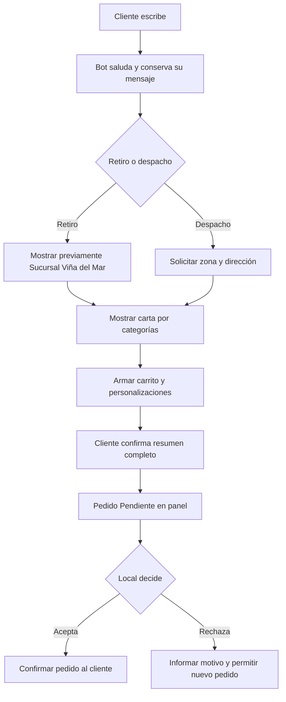

# HU-03 — Contexto transversal del MVP Viña del Mar

**Área:** Transversal  
**Estado:** Documento vivo; decisiones marcadas TODO no deben inventarse

## Historia

Como integrante del equipo,
quiero encontrar reglas, alcance y tecnologías del MVP en un solo lugar,
para desarrollar historias pequeñas sin depender del chat original.

## Alcance

- Un bot para un único número de WhatsApp Business.
- Solo Sucursal Viña del Mar.
- Retiro en local y despacho dentro de Viña del Mar.
- Carta de comida entregada en siete imágenes; tragos fuera del MVP.
- Panel interno para pedidos y atención humana.
- PedidosYa sigue siendo un canal independiente.
- No incluye página pública, múltiples sucursales ni automatización de repartidores.

## Flujo



## Conversación y sesión

- Experiencia híbrida: botones/listas más texto libre.
- El bot interpreta términos del cliente; si hay ambigüedad, pregunta.
- El primer mensaje siempre recibe bienvenida y su contenido no se pierde.
- Un carrito borrador se abandona tras 60 minutos sin actividad.
- Un cliente no puede crear otro pedido mientras tenga uno `Aceptado` y no `Entregado`.
- El cliente puede pedir atención humana; HU-20 define la transferencia.

## Horario y programación

- Se usan los horarios aprobados de Viña del Mar.
- Si está cerrado, informar próxima apertura.
- El admin puede cerrar excepcionalmente el local e indicar fecha y hora de reapertura.
- Un pedido programado debe ser al menos 30 minutos posterior a la hora actual y usar bloques de 15 minutos.
- `Lo antes posible` parte con 30 minutos. Antes de aceptar, el trabajador puede reemplazarlo ingresando minutos u hora exacta.
- **TODO:** revisar el valor predeterminado de 30 minutos después del piloto.

## Despacho

- Sin Google Maps en el MVP: cliente elige zona desde lista; dirección solo se guarda.
- Zonas/precios iniciales: `Poniente hasta Mall` $2.500; `Centro` $3.500; `Otros sectores cubiertos` $4.500.
- Sin cobertura: ofrecer solamente retiro.
- Dirección operativa provisional: `5 Norte 615, Viña del Mar`.
- **TODO:** confirmar límites exactos de zonas, cobertura de $4.500 y dirección oficial con responsable del local.
- El local coordina manualmente al repartidor después de aceptar.

## Carta y modificaciones

- Catálogo en JSON versionado; ocho categorías, orden y contenido en TEC-03.
- Quitar ingrediente: $0.
- Agregar o reemplazar cobra por unidad: pollo, palmito, champiñón o kanikama $1.000; camarón o salmón $1.500; atún o pulpo $2.000; acompañamiento $1.000; envoltura $2.000.
- Solo se ofrecen ingredientes presentes en la carta.
- El carrito muestra cada recargo y subtotal.
- Una alergia se guarda como nota destacada; no deriva automáticamente a humano.
- No existe stock automático: local acepta o rechaza según disponibilidad.

## Pedido y panel

- Pago al recibir o retirar: `Tarjeta` o `Efectivo`. Sin pago en línea.
- Datos: nombre y apellido; teléfono de WhatsApp; para despacho, zona, dirección y referencia opcional.
- Estados: `Pendiente`, `Aceptado`, `Rechazado`, `Entregado`.
- Tras 10 minutos pendiente, avisar demora y alertar panel. Sigue pendiente; nunca se rechaza solo.
- Solo un pedido aceptado puede marcarse entregado.
- Rechazo por falta indica producto e ingrediente; rechazo por cierre informa próxima apertura.
- Reabrir genera nuevo pedido y bloquea original. Si no quedan productos, vuelve a carta general.
- Pendientes/aceptados: más antiguos primero. Rechazados/entregados: más nuevos primero.
- Panel muestra pedidos de 3 días. Se conservan 90 días; después se elimina información personal y quedan estadísticas anónimas.
- Buscador por número de pedido, nombre o teléfono.
- Cuenta local entra a pedidos. CEO ve tarjeta `Sucursal Viña del Mar` y acceso a pedidos, conversaciones y auditoría completa.
- Acceso por usuario/contraseña. Desarrollador crea o restablece cuentas en MVP.

## Atención humana

- Admin puede tomar cualquier conversación; bot se pausa.
- Cola `Requiere atención`: más antigua primero. Cliente puede seguir escribiendo.
- Si nadie toma chat en 15 minutos: avisar indisponibilidad, reactivar bot y ofrecer continuar.
- Al devolver a bot: informar cambio, usar contexto humano, resumir acuerdo y pedir confirmación.
- Conversación humana completa queda guardada.

## Tecnologías aprobadas

| Pieza | Tecnología | Uso |
|---|---|---|
| Canal | Meta WhatsApp Cloud API directa | Webhooks/mensajes; sin Twilio, ManyChat ni n8n |
| Backend/panel | Cloudflare Workers | Reglas, API y panel económico |
| Datos | Cloudflare D1 | Conversaciones, pedidos, usuarios y auditoría |
| Lenguaje | OpenAI API, modelo económico | Solo cuando reglas deterministas no basten |
| Catálogo | JSON versionado | Carta estable del MVP |
| Trabajo | GitHub + GitHub Projects | Código, issues y tablero |

```text
Cliente → WhatsApp Cloud API → Cloudflare Worker → reglas
                                             ├→ OpenAI si hace falta
                                             ├→ D1
                                             └→ Panel Viña del Mar
```

## Costos esperados

- Cloudflare: comenzar gratis; Workers Paid desde USD 5/mes si uso lo exige.
- OpenAI: pago por uso; medir en piloto.
- Meta WhatsApp: tarifa vigente según tipo de mensaje y país; verificar antes de producción.
- Número/SIM: costo del operador.
- Sin Google Maps ni n8n.

## Puesta en marcha

- Primero número de prueba de Meta.
- Probadores: propietario del proyecto, Martin Cerpa y Bretti.
- Producción usará activos/número Business propiedad de Jiren Sushi; Jiren da acceso al desarrollador.
- **TODO:** crear/configurar Cloudflare y credenciales productivas.

## Material

- [Repositorio](https://github.com/304bxnjvv/jirensushi-whatsapp-bot)
- [Tablero](https://github.com/users/304bxnjvv/projects/1)
- [Instagram](https://www.instagram.com/jirensushi)
- [Carta](../technical/TEC-03-estructurar-carta-comida.md)

## Criterios de aceptación

- Desarrollador distingue alcance, decisiones y TODO sin leer chat original.
- No existen reglas activas de selección entre varias sucursales.
- Toda HU respeta este contexto salvo cambio posterior documentado.
