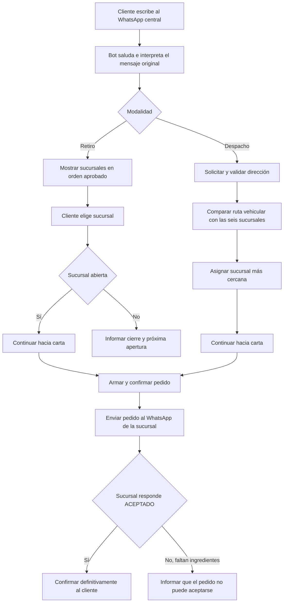

# HU-03 — Documentar contexto transversal del proyecto

**Área:** Transversal  
**Componentes:** Negocio, WhatsApp, backend, datos, IA y futuro dashboard  
**Tipo:** Historia habilitadora de documentación  
**Estado de definición:** Base inicial; las decisiones pendientes no deben asumirse

## Historia

Como integrante actual o nuevo del equipo,
quiero encontrar en un solo lugar las reglas de negocio, arquitectura, tecnologías, material de apoyo y decisiones pendientes,
para trabajar en una historia pequeña sin depender de conversaciones privadas ni inventar requisitos.

## Objetivo del producto

Crear un chatbot para un único número central de WhatsApp de Jiren Sushi. El bot debe conversar con el cliente, dirigir el pedido a la sucursal correcta y, finalmente, dejar el pedido cerrado y listo para preparar.

Instagram y Taplink serán puntos de entrada hacia ese WhatsApp. El MVP atiende solamente WhatsApp; no incluye un bot para Instagram.

## Contexto operativo actual

- Hoy cada sucursal tiene un número distinto y una persona atendiendo WhatsApp.
- Jiren Sushi quiere reemplazar esa fragmentación por un número central.
- Para despacho existen repartidores de confianza.
- Actualmente la persona del local publica el despacho en un grupo de repartidores y quien quiere tomarlo lo acepta.
- Se asume, todavía sin confirmación, que existe un grupo de repartidores por sucursal.
- PedidosYa también recibe pedidos, pero es un canal separado del chatbot.
- En el MVP, el bot enviará cada pedido al número de WhatsApp actual de la sucursal asignada.
- El cliente debe esperar hasta que la sucursal responda `ACEPTADO`; recién entonces recibe la confirmación definitiva.
- El futuro panel operativo no está descartado. Debe mostrar pedidos listos para preparar y podría ayudar a coordinar repartidores.
- La alternativa temporal de dejar pedidos en un chat fijado fue mencionada, pero no aprobada como solución.

## Sucursales y orden oficial en el bot

1. Valparaíso
2. Viña del Mar
3. Placilla
4. Reñaca
5. Quilpué
6. Quillota

## Flujo general aprobado



Las ramas posteriores a “continuar hacia carta” aún deben dividirse y definirse mediante historias pequeñas.

## Reglas de conversación aprobadas

- El bot siempre envía bienvenida ante el primer mensaje.
- Conserva e interpreta el mensaje original; el cliente no debe repetirlo.
- Debe seguir conversando de acuerdo con lo que diga el cliente.
- El cliente puede usar botones/listas o escribir libremente con sus propios términos.
- El bot reconoce equivalencias claras, por ejemplo: retiro, recoger, delivery, despacho y envío.
- Si hay ambigüedad, el bot pregunta; no inventa una respuesta.
- Experiencia aprobada: modelo híbrido entre controles interactivos y conversación natural.
- Mensaje inicial aprobado y casos detallados: [HU-01](./HU-01-iniciar-conversacion.md).

## Reglas de retiro aprobadas

- Después de elegir retiro, se muestran las seis sucursales en el orden oficial.
- Se puede seleccionar por lista o texto libre.
- Se toleran diferencias de tildes, mayúsculas y errores menores solamente cuando existe una coincidencia única.
- Si no se reconoce la sucursal, se vuelve a mostrar la lista completa.
- Se valida el horario exacto de la sucursal elegida.
- Si está abierta, se continúa hacia la carta.
- Si está cerrada, se informa solamente la próxima apertura y se termina ese flujo.
- No se ofrece automáticamente otra sucursal.
- No existe margen antes del cierre: se acepta hasta la hora publicada exacta.
- No se aceptan pedidos anticipados mientras el local está cerrado.
- El cliente podrá elegir “lo antes posible” o una hora fija futura, pero las reglas de preparación aún están pendientes.
- Horarios completos y casos detallados: [HU-02](./HU-02-seleccionar-sucursal-retiro.md).

## Reglas de despacho aprobadas

- La sucursal se seleccionará automáticamente por distancia de ruta vehicular, no por distancia en línea recta.
- Datos previstos: nombre del cliente, dirección completa y referencia opcional.
- Se solicitará ubicación de WhatsApp solamente si la dirección no puede validarse.
- El valor del despacho depende de zonas; zonas y precios quedan pendientes.
- La forma exacta de avisar y asignar al repartidor queda pendiente.
- La API oficial de WhatsApp no debe suponerse capaz de publicar en los grupos actuales. Se evaluarán avisos individuales y/o panel de repartidores en una etapa posterior.
- Durante el MVP, después de aceptar el pedido, la sucursal continuará coordinando manualmente con su grupo de repartidores.

## Carta, precios y stock

- Se trabaja provisionalmente con una misma carta, precios y promociones para todas las sucursales.
- Esta igualdad fue aceptada como supuesto y debe confirmarse contra una fuente oficial antes de cargar producción.
- El stock puede variar por local.
- Para el MVP se propuso disponibilidad simple (`Disponible` / `Agotado`). No quedó cerrada su administración.
- A futuro podría descontarse stock desde ingredientes, recetas y cantidades compradas por día o semana.
- Esa gestión avanzada de inventario está fuera de la etapa actual.

## Datos y pago aprobados

- Pago únicamente con tarjeta al retirar o al recibir el despacho.
- No habrá pago en línea en esta etapa.
- Para retiro se pide el nombre del cliente; el teléfono se obtiene desde WhatsApp.
- Para despacho se contempla nombre, dirección completa y referencia opcional.

## Entrega y aceptación del pedido

- El bot envía el pedido cerrado al WhatsApp actual de la sucursal seleccionada o asignada.
- El mensaje debe contener los datos necesarios para preparar el pedido.
- El pedido queda `Pendiente de aceptación` mientras la sucursal no responda.
- La respuesta `ACEPTADO` de la sucursal autoriza al bot a confirmar definitivamente al cliente.
- Si la sucursal rechaza por falta de ingredientes, el bot informa al cliente que el pedido no puede aceptarse porque no están disponibles los ingredientes necesarios.
- No se requiere panel operativo para este proceso durante el MVP.
- El comportamiento posterior al rechazo y ante falta de respuesta todavía debe definirse.

## Tecnologías aprobadas

| Pieza | Tecnología | Función | Decisión de costo |
|---|---|---|---|
| Canal | Meta WhatsApp Cloud API directa | Recibir webhooks y enviar mensajes oficiales | Sin Twilio, ManyChat ni intermediario |
| Backend | Cloudflare Workers | Ejecutar webhook y reglas del bot | Plan gratuito para piloto; Paid desde USD 5/mes si producción lo requiere |
| Base de datos | Cloudflare D1 | Guardar conversaciones, pedidos, sucursales y estados | Incluida en límites gratuitos de Workers |
| Lenguaje natural | OpenAI API, modelo económico | Interpretar texto libre cuando reglas deterministas no basten | Uso variable; invocarla solo cuando aporte valor |
| Direcciones | Google Maps Geocoding | Convertir y validar dirección | Nivel gratuito disponible; exige facturación y límites configurados |
| Cercanía | Google Maps Routes, Route Matrix | Comparar ruta vehicular hacia seis sucursales | Cada origen × destino cuenta como elemento |
| Dashboard futuro | Web estática/dinámica en Cloudflare | Operación de pedidos y posible coordinación | Alcance todavía pendiente |
| Código y planificación | GitHub + GitHub Projects | Repositorio, issues, historias y tablero | Plan gratuito actual |

### Arquitectura inicial aprobada

```text
Cliente → WhatsApp Cloud API → Cloudflare Worker → reglas deterministas
                                             ├→ OpenAI, solo para texto libre
                                             ├→ Google Maps, solo para despacho
                                             └→ Cloudflare D1
```

No se usará n8n inicialmente. Aunque puede autohospedarse, agrega servidor, actualizaciones y otra pieza operativa. Podrá reconsiderarse si aparecen automatizaciones externas complejas.

## Referencia económica inicial

Estimación investigada el **7 de septiembre de 2026**; debe revisarse antes de producción.

- Cloudflare: piloto potencialmente USD 0; presupuesto prudente de producción desde USD 5/mes.
- OpenAI: costo por uso. Presupuesto exploratorio mencionado: USD 3–10/mes; no es una cotización sin volumen real.
- Google Maps: Geocoding y Route Matrix Essentials incluyen 10.000 eventos/elementos gratuitos mensuales según tarifa consultada. Comparar un domicilio contra seis locales consume seis elementos de matriz.
- Número/SIM central: costo dependiente del operador; aún no definido.
- Dominio para panel: opcional.
- WhatsApp: al momento de la investigación, la página pública indica servicio gratuito dentro de la ventana de 24 horas iniciada por el cliente. Meta anunció cambios cercanos; se debe verificar la tarifa vigente al lanzamiento.

## Material de apoyo

- [Repositorio](https://github.com/304bxnjvv/jirensushi-whatsapp-bot)
- [Tablero del proyecto](https://github.com/users/304bxnjvv/projects/1)
- [Instagram Jiren Sushi](https://www.instagram.com/jirensushi)
- [Taplink con sucursales](https://taplink.cc/jirensushi)
- [Carta de referencia en Toliv](https://www.toliv.com/browse/chile/vina-del-mar/restaurant/jiren-sushi-vina-del-mar-1405)
- [Precios de WhatsApp Business Platform](https://whatsappbusiness.com/products/platform-pricing/)
- [Precios de Cloudflare Workers](https://developers.cloudflare.com/workers/platform/pricing/)
- [Precios de Cloudflare D1](https://developers.cloudflare.com/d1/platform/pricing/)
- [Precios de Google Maps](https://developers.google.com/maps/billing-and-pricing/pricing)
- [Precios de OpenAI API](https://openai.com/api/pricing/)

La carta de Toliv es una referencia dinámica, no una fuente técnica congelada. Antes de construir el flujo de productos se necesita una carta oficial exportable con productos, categorías, precios, promociones y modificadores.

## Decisiones pendientes — no asumir

- Número central definitivo, propietario, SIM y proceso de alta/migración en Meta.
- Direcciones y coordenadas oficiales de las seis sucursales.
- Carta oficial estructurada y confirmación de igualdad entre locales.
- Modificadores de productos: ingredientes, agregados, exclusiones y promociones.
- Tiempo de preparación y última hora válida para programar un retiro.
- Zonas y tarifas de despacho.
- Disponibilidad y actualización del stock por sucursal.
- Formato definitivo del mensaje enviado a la sucursal.
- Comportamiento posterior si la sucursal rechaza el pedido.
- Comportamiento si la sucursal no responde.
- Tiempo máximo que el cliente esperará la aceptación.
- Método de aviso, aceptación y reasignación para repartidores después del MVP.
- Cantidad real de grupos de repartidores y participantes.
- Roles, pantallas y estados del futuro dashboard operativo.
- Reglas para cancelar, modificar, duplicar o abandonar un pedido.
- Feriados, cierres excepcionales y cambios manuales de horario.
- Momento y condiciones para derivar la conversación a una persona.
- Volumen mensual de conversaciones, pedidos, mensajes y despachos.
- Retención de datos, permisos, privacidad y cumplimiento legal.
- Tarifas efectivas de Meta WhatsApp al momento de lanzamiento.

## Casos de uso de esta documentación

### Caso 1 — Incorporar a un desarrollador

**Dado** que una persona nueva accede al repositorio  
**Cuando** abre esta historia  
**Entonces** entiende objetivo, alcance, flujo, arquitectura, reglas aprobadas y enlaces principales.

### Caso 2 — Evitar supuestos

**Dado** que una tarea depende de una decisión todavía no tomada  
**Cuando** el desarrollador revisa “Decisiones pendientes”  
**Entonces** detiene esa parte y solicita definición antes de implementarla.

### Caso 3 — Ejecutar una historia pequeña

**Dado** que una regla está aprobada y detallada en HU-01 o HU-02  
**Cuando** el desarrollador toma esa historia  
**Entonces** puede trabajar sin ampliar el alcance a carta, despacho, inventario o dashboard.

### Caso 4 — Revisar costos

**Dado** que el equipo se prepara para lanzar  
**Cuando** consulta costos externos  
**Entonces** valida nuevamente las fuentes oficiales y reemplaza las estimaciones fechadas.

## Criterios de aceptación

- Se distingue claramente entre confirmado, supuesto y pendiente.
- Contiene todas las decisiones de negocio y tecnología discutidas hasta esta historia.
- Incluye contexto actual de locales y repartidores.
- Incluye flujo general y arquitectura inicial.
- Enlaza HU-01, HU-02, tablero, canales y fuentes tecnológicas.
- Ninguna decisión pendiente se presenta como requisito aprobado.
- Costos externos indican fecha y necesidad de revisión.
- Un desarrollador nuevo puede identificar qué implementar y qué preguntar.

## Fuera de alcance

- Implementar el chatbot.
- Configurar cuentas, números, APIs o infraestructura.
- Diseñar el dashboard operativo.
- Resolver cualquiera de las decisiones pendientes.
- Convertir la carta Toliv en catálogo productivo.
